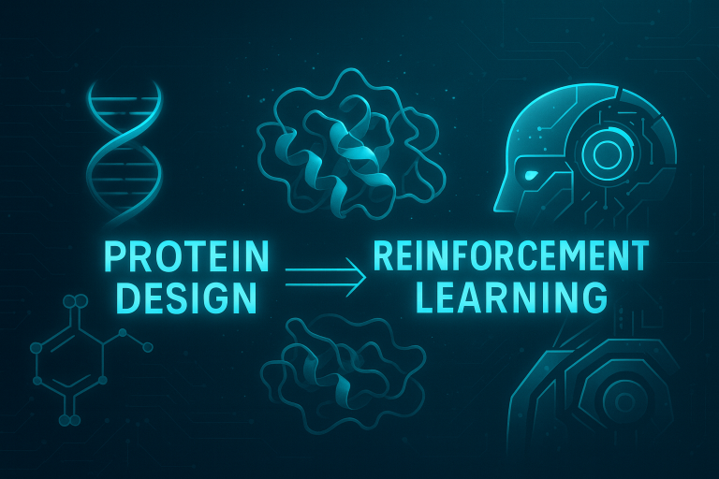
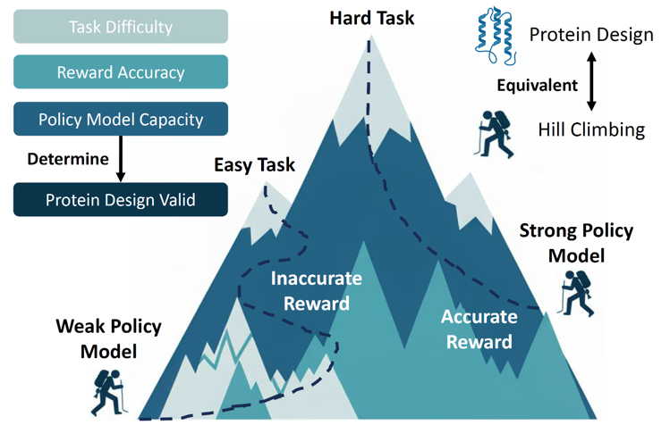
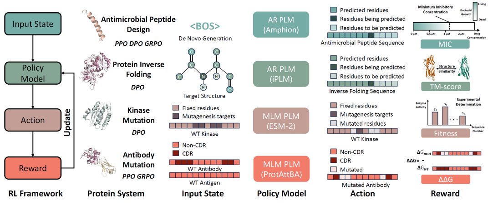

# From Supervision to Exploration: What Does Protein Language Model Learn During Reinforcement Learning?

This repository contains the implementation of the `RL-PLM` framework introduced in our paper:  
**[*From Supervision to Exploration: What Does Protein Language Model Learn During Reinforcement Learning?*](https://arxiv.org/abs/2510.01571)** (Arxiv preprint).



`RL-PLM` provides a unified platform for analyzing how reinforcement learning enhances and reshapes **Protein Language Models (PLMs)** across four biological design systems.  
The framework supports multiple RL algorithms—**DPO**, **PPO**, and **GRPO**—and integrates them with both **auto-regressive** and **masked-language** protein models.

---

  
*Figure 1. Conceptual analogy of RL for protein design—task difficulty, policy capacity, and reward accuracy jointly determine learning efficacy.*

---

## 📂 Repository Structure

```

RL-PLM/
│
├── amp_design/          # Antimicrobial peptide (AMP) design via RL
├── kinase_mutation/     # Kinase optimization via sequence mutation
├── antibody_mutation/   # Antibody–antigen binding optimization
└── inverse_folding/     # Structure-conditioned sequence generation
````

---

  
*Figure 2. Four biological systems implemented in RL-PLM.*

---

## 📦 Data and Model Weights

All datasets and pretrained checkpoints can be downloaded here:  
[**RL_PLM_data (Google Drive)**]([https://www.dropbox.com/](https://drive.google.com/)

Unzip and place the contents under your `BASE_PATH` before running any experiment.

---

## 🧬 Citation

If you find this repository useful, please cite:

```bibtex
@article{cao2025supervision,
  title={From Supervision to Exploration: What Does Protein Language Model Learn During Reinforcement Learning?},
  author={Cao, Hanqun and Zhang, Hongrui and Xu, Junde and Zhang, Zhou and Shen, Lingdong and Sun, Minghao and Liu, Ge and Xu, Jinbo and Li, Wu-Jun and Ni, Jinren and others},
  journal={arXiv preprint arXiv:2510.01571},
  year={2025}
}
}
```
